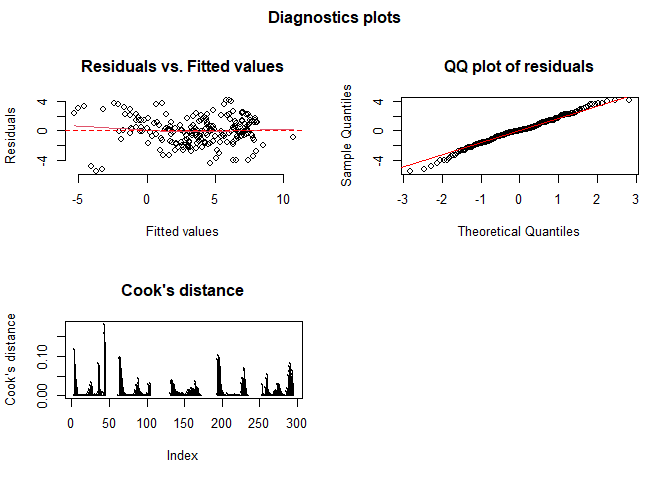
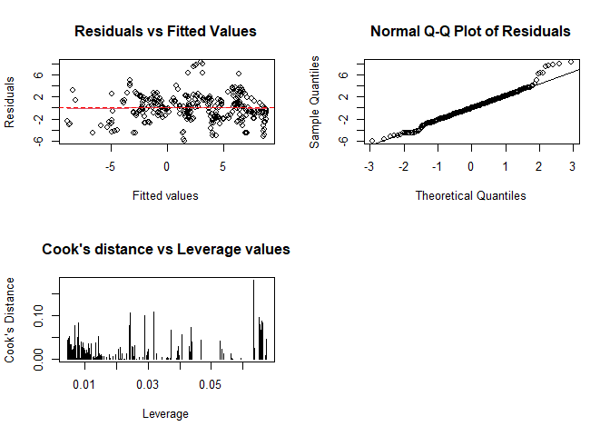

Abstract
========

Coronavirus disease 2019 is a contagious disease that has led to one of
the biggest pandemics across the world. There has been 115 million cases
of Covid-19 with 2.5 million deaths so far. One of the responses by
countries has been to issue a stay-at-home mandate which has levels that
range from no restrictions to a mandatory curfew. In this study, the
stay-at-home mandate with apporiate lag is used to estimate the growth
rate of infectious population. The exploratory data analysis showed that
the Daily Percent change in infectious population. From the result, it
is seen that each of the five countries had an increasing percent change
at the beginning of the time interval (October 1st), but over time the
daily percent change turned negative. This distribution was the same for
all five countries and possibly indicates a negative association between
stay-at-home mandate and infectious population. In the inferential
analysis, it shown using multiple tests that Fixed effects model was
better than random effects and ordinary least squares. We then use
propensity scores to test whether the significant variables in the fixed
effect model can cause the growth rate of infectious population to
change.

Introduction
============

Coronavirus Background
----------------------

Coronavirus disease 2019 (COVID-19) is a contagious disease caused by
severe acute respiratory syndrome coronavirus 2 (SARS-CoV-2). The first
case was identified in Asia in December 2019 and has rapidly spread
worldwide, leading to an ongoing pandemic. The spread of COVID-19 was
faster than previous pandemics like that of the influenza pandemic of
1918 because of interconnectedness of a global economy and the ease of
communication that that has increased global travels exponentially. As
of March 2021, there have been over 115 million cases of Covid-19 with
2.5 million deaths. \[6\] Symptoms of COVID-19 are variable, but often
include fever, cough, fatigue, breathing difficulties, and loss of smell
and taste. SARS-CoV-2, the virus that causes COVID-19, is primarily
spread when an infected person is in close contact with other people.
Small droplets and aerosols that contain the virus can spread from an
infected person’s nose and mouth when they breathe or talk. Then the
surrounding people are infected when those droplets and aerosols enter
their nose and mouth. Research has shown that infection mainly happens
when people are near each other for long enough. People who are infected
can transmit the virus sometimes up to two days before they themselves
show symptoms. It has been seen that asymptomatic victims of the
Covid-19 virus can still spread the virus if in close contact with
another person. The ways to prevent or reduce infection include the
practice of social distancing, ventilating indoor facilities, covering
one’s mouth and nose when sneezing, washing hands, and avoid touching
one’s face. Another method that has been employed to reduce infection is
to use a mask to cover one’s face and nose as studies have shown that
this minimizes the transmission risk \[7\]. Studies have also shown that
there is a delay between the moment a person first is infected and the
appearance of the preliminary symptoms. Symptoms may begin one to
fourteen days after exposure to the virus. The median delay for COVID-19
is four to five days. Most symptomatic people experience symptoms within
two to seven days after exposure, and almost all will experience at
least one symptom within 12 days \[8\]. Health professionals recommend
quarantining for 10-14 days after potential exposure to the virus.  
Social distancing across the world has been an effective measure to
prevention. The social distancing measures recommended by health
professionals include online learning at both the primary and college
levels. Employees e-commute to work. Bars and restaurants move from
dine-in to delivery. Malls were closed and shopping for food related and
non-food related items went online. Most importantly, people were
recommended to wear masks in public. Governments across the world have
issued mandates ranging from strict adherence to social distancing to
laxer or no mandates on social distancing. The strictest of these
measures by government of some countries was to issue a Stay-at-Home
mandate. The stay-at-home mandate was based on surge in COVID cases and
ranged from no restrictions to mandatory indoor curfew \[9\].  

From figure 1, the world average daily new case/new death/case
mortality, we can see that though the daily case mortality remains at a
steady low level after June, the daily new death has a jump from Oct to
Nov, and the daily new case has a sharp increase in October. Besides,
since many countries announced the stay-at-home policy between Oct and
Nov, we would narrow the time of interest into this period - October and
November.

Figure 2 shows the average daily new case/new death of each WHO Region.
For different regions, the daily new cases or new death are relatively
different. To gain a more robust result, we would focus our analysis on
one region rather than the whole world. Thus, region Europe was
selected, and countries that fit our inclusion criteria were included in
this analysis. To sum up, we narrow our analysis to five countries - UK,
Poland, France, Italy, Germany between October and November.  

The five European countries were identified as being matched on
comorbidities as well as similarity on transmission based on lower
variability in enforcing and implementing mandates on social distancing.
Another reason these five countries were chosen because of similarity on
demographics like race and ethnicity \[10\]. Both of which have been
shown to have an effect on Covid-19. Furthermore, data from October 1st
to November 30th was selected based on the distribution of similarity in
COVID-19 cases, as well as the non-availability of COVID-19 vaccines
during this period for these countries. Further, there were fewer
mutations of the virus till this timepoint \[11\].  There are two
primary motivations of this project.  

Obejctive
---------

There were two major objectives of the current project:

1.  **Find the lagged effect of stay-at-home order.** It is common that
    a policy takes time to reveal its effect after implementation. The
    lagged time of stay-at-home order on Covid-19 infectious population
    growth rate was unclear. Thus, we constructed a model to find the
    number of days after the policy started when its effect first became
    significant.

2.  **Investigate the effect of strictness of stay-at-home order on
    growth rate of infectious population.** Using the lagged time found
    in the first part, this model would investigate how the strictness
    of policy and change in such policy affect the response variable.

Background
==========

Target population
-----------------

During October and November 2020, daily reported cases in Americas and
Europe skyrocketed. In response to such rapid increase in infected
cases, many countries strengthened their stay-at-home order as one of
the acts to control the spread of Covid-19. The question of interest is
the effect of such policy response on containing the spread of disease.
Admittedly, there are many factors other than the stay-at-home order
that could affect the spreading rate, especially there were big regional
differences among countries across the world, such as weather, economic
status, demographics, medical conditions, and other Covid-19 related
policies. Also, not all the regions had such peaks in Covid-19 cases as
observed in Americas and Europe. In order to establish a causal
inference of stay-at-home order on Covid-19 spread, we would like to
target countries with similar geographic locations, and experienced
similar total number and trends of Covid-19 cases during October to
November 2020. Given such consideration, we decided to look at the top
five European countries with population density over 100/km2
and land area over 100,000 mi2. Since we were concerned about
the spread of Covid-19, it was reasonable to focus on countries with
comparable population density as well as total number of cases. *Using
such criteria, the five countries we focused our analysis on are:
Germany, UK, France, Italy, and Poland.* All five countries made some
changes to their stay-at-home policy during the period between October 1
and November 31,2020.

Data
----

Contry level daily and cumulative Covid-19 cases and deaths data was
obtained from the World Health Organization (WHO) website
(<a href="https://covid19.who.int/WHO-COVID-19-global-data.csv" class="uri">https://covid19.who.int/WHO-COVID-19-global-data.csv</a>).
The country level stay-at-home order information was obtained from “Our
World in Data - statistics and research on conronavirus pandemmic”
(<a href="https://ourworldindata.org/covid-stay-home-restrictions" class="uri">https://ourworldindata.org/covid-stay-home-restrictions</a>).
The source of the data was published by Oxford COVID-19 government
response tracker and was maintained up-to-date.

### Predictors

The predictor “stay-at-home order” is a categorical variable with four
levels:

-   0 - no measures
-   1 - recommend not leaving house
-   2 - require not leaving house with exceptions for daily exercise,
    grocery shopping, and ‘essential’ trips
-   3 - Require not leaving house with minimal exceptions (e.g. allowed
    to leave only once every few days, or only one person can leave at a
    time, etc.)

None of the country in our target population had the most strict level
“3” measure.

### Response variable

The spread of a disease is an exponential process. The classic SIR model
in epidemiology describes the process as follows: in a population (N),
each of the infected ones (I) had the potential to infect one or more
susceptible people (S) before they recover or die (R). At any time *t*,
we have *N* = *I*(*t*) + *S*(*t*) + *R*(*t*), assuming people who have
recovered will be immuned. Based on this model, for a country c at time
t, the growth rate of infectious population is defined as:
$$dI\_{ct}/dt = I\_{ct} - I\_{c,t-1} = \\beta I\_{c,t-1} \\frac{S_ct}{N_ct} - \\gamma I\_{c,t-1}$$
where *β* is the rate of infection, and *γ* is the rate of recovery.
Since the total number of people who have been infected was small
compared to the whole population, we assumed that
$\\frac{S_ct}{N_ct} =1$.

The WHO dataset had information on daily new cases and cumulative cases,
but not the number of recoveries, therefore we could not know the exact
number of infectious population (I). In order to estimate it, we assumed
that it took 7 days for a person to recover from Covid-19, starting from
the day it was reported. That is, people who were reported to be
positive on day 0 would be removed from the infectious population on day
7. Such an estimate could be not that accurate due to lack of
information. Adjutment of this parameter could be done in future study.
With this assumption, infectious population could be estimated as:
$$
\\begin{aligned}
I\_{ct} &= y\_{ct} - y\_{c,t-7} \\\\
I\_{c,t-1} &= y\_{c,t-1} - y\_{c,t-8}
\\end{aligned}
$$
where *y**c**t* is the number of cumulative case in country c
on date t.

With this estimate, the growth rate of infectious population (percentage
point)

$$\\Delta y\_{ct} = \\frac{I\_{ct} - I\_{c,t-1}}{I\_{c,t-1}} = \\frac{(y\_{ct} - y\_{c(t-7)}) - (y\_{c(t-1)} - y\_{c(t-8)})}{y\_{c(t-1)} - y\_{c(t-8)}}$$
was used as the response variable to reflect the spread of Covid-19.

Descriptive analysis
====================

Summary Statistics of Variables in WHO Data set
-----------------------------------------------

|   Date_reported    |   Country_code   |     Country      |    WHO_region    |
|:------------------:|:----------------:|:----------------:|:----------------:|
|  Min. :2020-01-03  |  Length:106436   |  Length:106436   |  Length:106436   |
| 1st Qu.:2020-04-24 | Class :character | Class :character | Class :character |
| Median :2020-08-15 | Mode :character  | Mode :character  | Mode :character  |
|  Mean :2020-08-15  |        NA        |        NA        |        NA        |
| 3rd Qu.:2020-12-06 |        NA        |        NA        |        NA        |
|  Max. :2021-03-28  |        NA        |        NA        |        NA        |
|         NA         |        NA        |        NA        |        NA        |

Table continues below

|  New_cases   | Cumulative_cases |  New_deaths   | Cumulative_deaths |
|:------------:|:----------------:|:-------------:|:-----------------:|
| Min. :-32952 |     Min. : 0     | Min. :-514.00 |     Min. : 0      |
|  1st Qu.: 0  |   1st Qu.: 11    | 1st Qu.: 0.00 |    1st Qu.: 0     |
|  Median : 5  |  Median : 1343   | Median : 0.00 |    Median : 24    |
| Mean : 1187  |  Mean : 158151   | Mean : 26.02  |    Mean : 3984    |
| 3rd Qu.: 223 |  3rd Qu.: 26565  | 3rd Qu.: 3.00 |   3rd Qu.: 453    |
| Max. :402270 |  Max. :29859706  | Max. :6409.00 |   Max. :543003    |
|      NA      |        NA        |      NA       |        NA         |

Table continues below

| Case_Mortality_new | Case_Mortality_Cumulitive |
|:------------------:|:-------------------------:|
|     Min. :-Inf     |        Min. :0.000        |
|    1st Qu.:0.00    |       1st Qu.:0.006       |
|    Median :0.01    |       Median :0.017       |
|     Mean : NaN     |        Mean :0.025        |
|    3rd Qu.:0.03    |       3rd Qu.:0.031       |
|     Max. : Inf     |        Max. :1.000        |
|    NA’s :45528     |        NA’s :21282        |

Exploratory Data Analysis
-------------------------

Our question of interest is related to stay at home policy. Hence, we
would like to see what happens after the policy was announced.

From figures 3 and 4, the daily new deaths/cases of each country, we can
barely see the impact of stay-at-home policy while looking at daily new
cases or daily new death for countries and time we selected. We can
observe that daily new death/case increases while after the policy was
published. Thus, to investigate whether the policy works, instead of
daily new cases or deaths, we can look at the percent change in
infectious populations (delta infectious). Figuer 5 shows stay-at-home
plicy change for all five countries. Figure 6 shows the daily delta
infectious for each country, and this delta infectious decrease in
general and were negative after Nov 15, which indicates quarantine had
an impact.

Inferential analysis
====================

Lagged effect of stay-at-home order
-----------------------------------

### Model justification

As observed in the world trend of daily cases of Covid-19, there was a
peak between October and November in many countries, including the five
European countries that we focused on in this project. In response to
such skyrocketing numbers of cases, all five contries issued
stay-at-home orders around that period of time in hope to contain the
spread of Covid-19. It was also noticed that there was a delay between
the order starting date and the date when daily new cases began to
decrease, which was expected since most of policies would have a lagged
effect. *In order to understand the temporal dynamics of the
stay-at-home order, we measured the policy effects on growth rate of
infectious population as a function of time since the order started.*
Number of days since the order started was treated as a categorical
variable with each day as a level. We looked at the period of 14 days
before and 28 days after the order came into effect. The estiamted
coefficients could be considered as the change in infectious population
growth rate due to the stay-at-home order without varying implementation
time.

A fixed effect regression model was constructed. One advantage of this
model is that it controls for unobserved country-specific factors that
were not included as predictors.This model is equivalent to a
difference-in-difference model with variation in treatment time.

### Model setup and parameter notation

An one-way fixed effect regression model was defined as:
*Δ**y**c**t* = *β**c* + ∑*τ* ≠  − 1*β**τ**X**c**t**τ* + *ϵ**c**t*

**Parameter notation**  

-   *Y**c**t* is the response variable: % growth rate in
    infectous population of country c at time t.

-   *β**c* is the counry-specific, time-invariant fixed
    factor for country c.

-   *τ* is the number of days prior to or after the stay-at-home order
    was issued.

-   *β**τ* is the effect size of the policy on the growth
    rate of infectious population *τ* days before/after the policy
    started.

-   *X**c**t**τ* are dummpy variables indicating whether day
    t is the *τ* day before or after policy started in country c. 

**Assumptions**  

-   Conditional relationship of *Y**c**t* given
    *X**c**t**τ* is linear in the explanatory variables.

-   *ϵ**c**t* are independent random variables with zero mean
    and constant variance:
    *E*(*ϵ**i**t*) = 0, *V**a**r*(*ϵ**i**t*) = *σ*2

**Hypothesis**  

-   *H*0: all *β**τ* = 0 vs. *H**a*:
    not all *β**τ* = 0

### Model fitting results

**Table 1** summarized the coefficient estimates and their 95%
confidence intervals for 0 \~ 28 days after the policy started, which
could be interpreted as the effect of different implemetation date on
growth rate of infectious population. Negative values indicated that the
growth rate of infectious population was slowing down. As shown in the
table, the effect of stay-at-home order on flattering the curve started
to become significant (p\<0.05) at day 13 after it was first
implemented. The figure below visualized the effect of stay-at-home
order before and after it was implemented. The days prior to policy
implementation was also included in the model to test for any reversed
causal effect. The figure showed that the coefficients estimates before
the policy started were not significantly different from zero,
confirming that the growth rate in infectiou population did not affect
the policy starting date.

| Days_since_start | Estimate | CI_lower | CI_upper |
|:----------------:|:--------:|:--------:|:--------:|
|        0         |  -0.22   |  -2.77   |   2.33   |
|        1         |  -0.30   |  -2.84   |   2.25   |
|        2         |  -0.26   |  -2.80   |   2.29   |
|        3         |  -0.62   |  -3.17   |   1.92   |
|        4         |  -0.49   |  -3.04   |   2.05   |
|        5         |  -0.51   |  -3.05   |   2.04   |
|        6         |  -0.54   |  -3.09   |   2.00   |
|        7         |  -0.54   |  -3.09   |   2.01   |
|        8         |  -0.91   |  -3.45   |   1.64   |
|        9         |  -1.30   |  -3.85   |   1.25   |
|        10        |  -1.48   |  -4.02   |   1.07   |
|        11        |  -1.92   |  -4.47   |   0.62   |
|        12        |  -2.49   |  -5.04   |   0.06   |
|        13        |  -2.94   |  -5.49   |  -0.40   |
|        14        |  -3.22   |  -5.77   |  -0.67   |
|        15        |  -3.36   |  -5.91   |  -0.82   |
|        16        |  -3.56   |  -6.11   |  -1.01   |
|        17        |  -4.01   |  -6.56   |  -1.47   |
|        18        |  -4.13   |  -6.68   |  -1.58   |
|        19        |  -3.78   |  -6.33   |  -1.24   |
|        20        |  -4.24   |  -6.79   |  -1.69   |
|        21        |  -4.81   |  -7.36   |  -2.27   |
|        22        |  -5.29   |  -7.84   |  -2.75   |
|        23        |  -5.71   |  -8.26   |  -3.17   |
|        24        |  -5.98   |  -8.53   |  -3.44   |
|        25        |  -6.81   |  -9.36   |  -4.27   |
|        26        |  -8.17   |  -10.72  |  -5.62   |
|        27        |  -8.64   |  -11.18  |  -6.09   |
|        28        |  -8.96   |  -11.50  |  -6.41   |

Table 1: Coefficient estimates from regression of daily growth rate of
Covid-19 infectious population on number of days since stay-at-home
order

-   The dashed red lines dictated D-day of the policy and 13 days after
    its implementation when its effect on reducing growth rate of
    infectious population firstly became significant.

Effect of policy strictness on infectious population growth rate
----------------------------------------------------------------

To find out whether the change in level of stay-home restriction has an
impact on the rate of growth in active infections, we fit a panel
regression model as follows:
*Δ**y**c**t* = *α**c* + *α**t* + *β*1, 1*x*1, 1, *c**t* + *β*1, 2*x*1, 2, *c**t* + *β*2,  − 1*x*2,  − 1, *c**t* + *β*2, 1*x*2, 1, *c**t* + *β*2, 2*x*2, 2, *c**t* + *β*3*x*3, *c**t* + *u**c**t*
where

1.  *Δ**y**c**t* is the change in rate of active infections
    for country *c* at time *t*, which is calculated using

$$
\\Delta y\_{ct} = \\frac{(y\_{ct} - y\_{c(t-7)}) - (y\_{c(t-1)} - y\_{c(t-8)})}{y\_{c(t-1)} - y\_{c(t-8)}}
$$
where *y**c**t* is the number of new cases for country *c* at
time *t*.

1.  *α**c* is the country-level fixed effect, ie.
    *c* = {France, Germany, UK, Poland, Italy}.

2.  *α**t* is the time-level fixed effect, ie. the dates
    reported for this data analysis, *t* = {10/01/2020, …, 11/30/2020}.

3.  *x*1, *i*, *c**t* is the stay-home requirement level for
    country *c* at 14 days prior to time *t*, ie. *i* = {0, 1, 2}. Since
    *x*1, *c**t* is represented as dummy variables, the case
    for *x*1, 0, *c**t* is implied by the model when
    *x*1, 1, *c**t* = *x*1, 2, *c**t* = 0.

4.  *x*2, *j*, *c**t* is the change in stay-home requirement
    for country *c* at the previous week of (4). This is computed as
    follows:
    $$
    x\_{2,j,ct} = \\mathbb{1}\_{\\{x\_{1,i,ct} - x\_{1,i',c(t-7)}\\}} \\ {\\rm for } \\ i,i' = \\{0,1,2\\}, j = \\{-1, 0, 1, 2\\} 
    $$
    where *j* =  − 1 represents a 1 level relaxation of the stay-at-home
    orders, *j* = 0 represents no change in the stay-at-home orders,
    while *j* = 1, 2 represents an increase in strictness of
    stay-at-home policy by 1 and 2 levels respectively. Since
    *x*2, *c**t* is represented as dummy variables, the case
    for *x*2, 0, *c**t* is implied by the model when
    *x*2, 1, *c**t* = *x*2, 2, *c**t* = *x*2,  − 1, *c**t* = 0.

5.  *x*3, *c**t* is the change in rate of active infections
    for country *c* 14 days prior to time *t*, which is a 14-day lag of
    same measurement of the response variable *Δ**y**c**t*.

6.  *u**c**t* is the error for country *c* at time *t*.

This model comes with a few advantages. The fixed effect
*α**c* controls the time-invariant effect of countries which
can impact the change in rate of active infections for each country, eg.
weather, socioeconomy status, local health care system, and population
size \[1\]. The fixed effect *α**t* controls the factors that
vary over time. As discussed by Fowler et al., this includes the changes
in testing availability, national policies that vary over time, and the
occurence of major events that impacts social behaviors of people in the
country. However, the panel regression model also comes with some strict
assumptions. These assumptions and diagnostics are tested and discussed
under the Sensitivity Analysis section.

The fitted model gives us the following estimates:

    ##                                                 Estimate Std. Error    t-value
    ## Stay-home restriction at t-14 == 1            -6.2614341 0.44635907 -14.027796
    ## Stay-home restriction at t-14 == 2            -8.4295097 0.43283667 -19.475036
    ## Change in stay-home restriction at t-14 == 0   2.9547889 0.73392282   4.026021
    ## Change in stay-home restriction at t-14 == +1  4.7172430 0.86664221   5.443126
    ## Change in stay-home restriction at t-14 == +2  7.3166070 1.08318955   6.754688
    ## Change in rate of active infections at t-14    0.3646687 0.04944015   7.375963
    ##                                                   Pr(>|t|)
    ## Stay-home restriction at t-14 == 1            1.414153e-34
    ## Stay-home restriction at t-14 == 2            7.824486e-55
    ## Change in stay-home restriction at t-14 == 0  7.224535e-05
    ## Change in stay-home restriction at t-14 == +1 1.105141e-07
    ## Change in stay-home restriction at t-14 == +2 7.660531e-11
    ## Change in rate of active infections at t-14   1.673817e-12

The fixed effect coefficients for the countries are obtained as shown
below:

    ##            alpha[c]
    ## France  -0.08299574
    ## Germany  2.81547385
    ## Italy    2.34370263
    ## Poland   1.08685443
    ## UK       4.22152715

We can interpret the *α̂**c* values above as a growth rate in
active infections when there were stay-at-home policies were relaxed to
level 0 in the previous 2-3 weeks. As we can see that most
*α̂**c* values are positive (except France), it means that the
growth rate of active infections increases significantly in these 4
countries when there are no stay-at-home policies in place. This is
especially the case in the UK with its growth rate of more than 4.

Based on the results above, it is also obvious to see that a sticter
stay-at-home policy results in a larger decrease in rate of growth in
active infections. This linear association is accompanied by a strong
*R*2 and adjusted *R*2 values of 0.71 and 0.7
respectively. Assuming there are no changes in stay-at-home policies, a
level-2 stay-at-home restriction (-8.43) reduces the growth rate of
active infections by more than 2 as compared to a level-1 stay-at-home
restriction (-6.26).

On the other hand, a change in policy on the stay-at-home restriction
2-3 weeks prior also has a significant impact on the growth rate in
active infections. Assuming a country increased its stay-at-home level
within the past 2-3 weeks (eg. from level 0 to level 2), we still expect
to observe a decreasing growth rate in active infections. For instance,
Italy, who wsn’t implementing any form of stay-at-home restriction up
until mid-October, would expect to observe a decrease in growth rate of
active infections by  − 1.12(ie.  − 8.43 + 7.31) in November.

Meanwhile, it is also important to note that the change in rate of
active infections are also affected by its own value from 2 weeks prior.
Its coefficient estimate of 0.36 suggests that a country’s change in
rate of active infections will continuously increase if no stay-at-home
policies were put in place.

### Siginificance of predictor variables

An important aspect when interpreting the fitted model above is to
ensure that the coefficient estimates are significant. In other words,
the standard errors of the coefficient estimates should not be so large
such that there are no significant evidence that the predictor variables
correlate with the change in rate of active infections. To test this, we
will use the *F*-test to check the significance of each predictor
variable.

-   **14-day lagged effect of stay-at-home order **   The null and
    alternate hypothesis are
    $$
    H_0: \\beta\_{1,1} = \\beta\_{1,2} = 0 {\\rm \\ vs \\ } H_a: \\text{at least one of }\\beta\_{1,i} \\neq 0
    $$
    Since the p-value obtained from the *F*-test is less than 2e-12, we
    reject the null hypothesis and conclude that the 14-day lagged
    effect of stay-at-home order is significant.

-   **14-day lagged effect of change in stay-at-home order**   The
    null and alternate hypothesis are
    $$
    H_0: \\beta\_{2,1} = \\beta\_{2,2} = \\beta\_{2,-1} = 0 {\\rm \\ vs \\ } H_a: \\text{at least one of }\\beta\_{2,j} \\neq 0
    $$
    Since the p-value obtained from the *F*-test is approximately 1e-10
    (\< 0.001), we reject the null hypothesis and conclude that the
    14-day lagged effect stay-at-home policy change is significant.

-   **14-day lagged effect of change in rate of active infections**  
    The null and alternate hypothesis are
    $$H_0: \\beta\_{3} = 0 {\\rm \\ vs \\ } H_a: \\beta\_{3} \\neq 0$$
    Since the p-value obtained from the *F*-test is approximately 1e-12
    (\< 0.001), we reject the null hypothesis and conclude that the
    14-day lagged effect of the change in rate of active infections is
    significant.

Overall, we have shown that all three predictor variables are
significant in determining the change in rate of active infections.

Sensitivity analysis
====================

Lagged effect of stay-at-home order
-----------------------------------

First, the necessity of adopting a individual fixed effect model was
tested by comparing the current model with a pooling model where all
countries’ data were pooled together. The null hypothesis that the two
models are indistinguishable was rejected (p\<0.05), indicating that it
was necessary to use a fixed effect model accounting for
country-specific factors.

The calculated *R*2 and adjusted *R*2 for the
model were 0.74 and 0.68 respectively.

The diagnostics plots below tested the homocedasticity and normality
assumption, as well as the presence of outliers. The residuals
vs. fitted value plot showed that the residuals were mostly evenly
distributed around zero but with a slightly quadratic pattern. QQ plot
confirmed the normality assumption was fulfilled. And the Cook’s plot
showed that no observation had cook’s distance larger than 1, indicating
that there was no influential cases.

Effect of policy strictness on infectious population growth rate
----------------------------------------------------------------

### Model Assumptions and Justifications

The assumptions for this model are as follows:

1.  All *x*1, *c**t* and *x*2, *c**t* are
    identically and independently distributed (i.i.d).

2.  Perfect multicollinearity within predictor variables do not exist.

3.  The error term *u**c**t* has conditional mean zero.

4.  Homocedasticity (constant variance) of the response variable
    *Δ**y**c**t*.

5.  Influential outliers do not exist.

Assumptions (3), (4), and (5) have been easily satisfied as shown in the
plots above. In the residuals vs fitted values plot, we observe that the
data is randomly distributed with no particular pattern, and that they
are centered around mean zero. This satisfies the homocedasticity
(constant variance) and zero mean constraint of the error term.
Additionally, we also observe from the Q-Q plot that the residuals are
distributed normally. The Cook’s distance vs Leverage plot shows a
maximum Cook’s Distance value of less than 0.2, we conclude that
outliers did not exist in this model. As for assumption (2),
multicollinearity can be checked by calculating the variance inflation
factor (VIF) of the predictor variables. Specifically, The VIF of the
*k*th predictor, denoted as *V**I**F**k*, is defined as
$$
VIF_k = \\frac{1}{1-R_k^2}
$$
where *R**k*2 is the coefficient of multiple
determination when the predictor variable *X**k* is regressed
onto the rest of the *X* variables. The VIF values of each predictor is
shown in the table below. Since each *V**I**F**k* values are
close to 1, we conclude that there is no issue of multicollinearity.

    ##                                                 GVIF Df GVIF^(1/(2*Df))
    ## Stay-home restriction at t-14               1.688579  2        1.139936
    ## Change in stay-home restriction at t-14     1.706997  3        1.093215
    ## Change in rate of active infections at t-14 1.266450  1        1.125366

On the other hand, assumption (1) cannot be satisfied by this model.
This is because the predictor variables such as the stay-at-home
restrictions or the policy changes are not i.i.d. distributed, as each
of these entity are dependent on their previous values.

### Model Diagnostics

The following are some model diagnostics that were considered for this
analysis:

1.  Test for fixed effects vs random effects

2.  Test for time fixed effects

3.  Test for cross-sectional dependence

For (1), the following hypothesis were computed using the F-test and the
Breusch-Pagan Lagrange Multiplier (LM) test respectively to ensure that
the ordinary least squares (OLS) model is not the best model.
$$
{\\rm Test \\ 1:} \\ H_0: {\\rm OLS \\ model \\ is \\ a \\ better \\ fit \\ \\ vs \\ } H_a: {\\rm Fixed-effect \\ model \\ is \\ a \\ better \\ fit}
$$
$$
{\\rm Test \\ 2:} \\ H_0: {\\rm OLS \\ model \\ is \\ a \\ better \\ fit \\ \\ vs \\ } H_a: {\\rm Random-effect \\ model \\ is \\ a \\ better \\ fit}
$$
As both p-values were close to 0, we conclude that the OLS model is not
a good fit for our data. We then moved on to check whether the
fixed-effect model or the random-effect model gives us a better fit
using Hausman Test with the following hypothesis:
$$
H_0: {\\rm Random-effects \\ model \\ is \\ a \\ better \\ fit \\ \\ vs \\ } H_a: {\\rm Fixed-effects \\ model \\ is \\ a \\ better \\ fit}
$$
Here we obtained a p-value of 0.68, suggesting that *H*0
cannot be rejected and therefore a random effects model is a better fit.
However, it is important to note that setting countries as random
entities would reduce the explainability of our current model.

To check for (2), we once again used the Breusch-Pagan LM test with the
following hypothesis:
$$
H_0: {\\rm Time-effects \\ is \\ significant \\ \\ vs \\ } H_a: {\\rm Time-effects \\ is \\ insignificant}
$$
The p-value obtained in this test is less than 0.002. Using a threshold
*α* \< 0.05, we reject *H*0 and conclude that our current
model is a better fit.

Lastly, it is important to test for cross-sectional dependence (3) in
our model as we previously assumed that entities within each country are
not correlated. Once again, using the Breusch-Pagan LM test with the
following hypothesis, we obtained an extremely small p-value which
suggests that cross-sectional dependence exist within our model.
$$
H_0: {\\rm No \\ cross-sectional \\ dependence \\ \\ vs \\ } H_a: {\\rm Cross-sectional \\ dependence \\ exist}
$$
Overall, we managed to satisfy most of the assumptions of a fixed-effect
model, except for the fact that cross-sectional dependence exist within
our model, which suggests that the predictors are not entirely
independent, which can lead to Type-1 error inflation.

Causal interpretation
=====================

Since this study is observational, causality is difficult attain
directly due to selection bias. Therefore, propensity score analysis was
preformed using the lag of the stay-at-home variable as the treatment
variable. The variables selected for the causal inference were the
14-day lagged effect of stay-at-home order, 14-day lagged effect of
change in stay-at-home order, and 14-day lagged effect of change in rate
of active infections as these three variables were significant in
predicting change in rate of active infections. However, lag of stay at
home is not a binomial variable as it has 3 levels (0,1, and 2).
Therefore, it was appropriate to develop the propensity scores using a
Generalized Boosted Model \[12\].

    ##                                                 Estimate Std. Error    t-value
    ## Stay-home restriction at t-14 == 1            -6.4737452 0.45985817 -14.077700
    ## Stay-home restriction at t-14 == 2            -8.3389763 0.39078086 -21.339265
    ## Change in stay-home restriction at t-14 == +2  2.9959592 1.00110404   2.992655
    ## Change in stay-home restriction at t-14 == -1  4.5815798 1.18734992   3.858660
    ## Change in stay-home restriction at t-14 == +1  6.6882848 1.44771679   4.619885
    ## Change in rate of active infections at t-14    0.4242872 0.04988186   8.505841
    ##                                                   Pr(>|t|)
    ## Stay-home restriction at t-14 == 1            9.276867e-35
    ## Stay-home restriction at t-14 == 2            1.101069e-61
    ## Change in stay-home restriction at t-14 == +2 3.000229e-03
    ## Change in stay-home restriction at t-14 == -1 1.401655e-04
    ## Change in stay-home restriction at t-14 == +1 5.750894e-06
    ## Change in rate of active infections at t-14   9.295829e-16

Once the model with the propensity score weighted results was created,
it was found that no significant changes were made to the model meaning
that the estimates were similar, and variables were significant in both
models (shown above). This leads us to conclude that causal inference
can be applied which means that when the stay-at-home mandate is at
level 1 or level 2 then there is a decrease in change in rate of active
infections.

Discussion
==========

Recap of Project
----------------

The primary goals of this project is to see the effect of stay at home
mandates on rate of infections for the COVID-19 virus as well as to see
if there is a lag component of the mandate on rate of infections.
Furthermore, the goal is to build a model to predict change in rate of
active infections. The data used for analysis was downloaded from World
Health Organization. Variables retained for analysis were daily
frequency of new cases, new deaths, as well as cumulative cases and
cumulative deaths. Data pertaining to stay-at-home mandate was
downloaded from the ‘Our World in Data’ database. The basic unit of
analysis for this dataset are the daily frequency of new cases for the
period October 1st to November 30th for each of these five countries
(United Kingdom, Germany, Poland, Italy, France). Selection of the
time-period as well as region was done to control for the effect of
demographics like race and ethnicity, conflicts in implementation of
mask mandates between local and national governments, effect of
mutations of the COVID-19 virus as well as the effect of the COVID-19
vaccine on the frequency of daily new cases.  

The variables were plotted against time by country to see their
distributions. The key indicator of the exploratory data analysis was
the Daily Percent change in infectious population. From the result, it
is seen that each of the five countries had an increasing percent change
at the beginning of the time interval (October 1st), but over time the
daily percent change turned negative. This distribution was the same for
all five countries and possibly indicates a negative association between
stay-at-home mandate and infectious population.

Findings of Inferential Analysis
--------------------------------

Panel regression analysis was used to build a predictive model for the
response variable change in rate of active infections by country. The
variables in the model were Country (time invariant fixed factor),
stay-at-home mandate. Lag variables were created based on number of days
prior to or after the mandate was implemented and this lag variable was
dummy coded. Multiple models were considered to find the best model for
the outcome variable. The models that were considered for the analysis
were the fixed effects model, an ordinary least squares model, a random
effects model, and a time variant model. Multiple tests like the F-test,
Hausman test, and Lagrange Multiplier Test were used to select the best
predictive model for rate of active infections. The results of the
analyses indicate that the fixed effects model was the best at
predicting change in rate of active infections. The inferential analysis
findings were that 14-day lagged effect of stay-at-home order, 14-day
lagged effect of change in stay-at-home order, and 14-day lagged effect
of change in rate of active infections showed statistically significant
associations with change in rate of active infections. Mandate
recommending not leaving the house (level 1) was negatively associated
with change in rate of active infections when compared to
no-restrictions (level 0) on stay-at-home mandate. Mandate requiring not
leaving the house with exceptions to daily exercise, grocery shopping
and essential trips (level 2) was also negatively associated with change
in rate of active infections when compared to no-restrictions (level 0)
on stay-at-home mandate. There is also a positive association of a
14-day lag between change in stay-at-home order level and change in rate
of active infections for all levels (no restriction; requiring not
leaving the house with exceptions to daily exercise, grocery shopping
and essential trips; and no restriction to recommending not leaving the
house). Rate of active infections was positively associated at a prior
lag of 14-days to rate of active infections at lag 0.  

Based on propensity scores from causal inference, we can conclude that
in the selected countries of Europe, stay-at-home policies can predict
significant changes in rate of infections.  

Caveats of Current Analysis
---------------------------

There were a few caveats to this study. The first is that the data is
only taken from October 1st to November 30th, which does not allow us to
account for the effect of different seasons on rate of active
infections. The second caveat is the limited generalization of result
findings. To control for comorbidities the data were selected from just
5 European countries. Generalizations of the results is, therefore,
limited to the selected countries. The final caveat is that the
Breusch-Pagan LM test showed that cross-sectional dependence exists
within the model meaning that change in rate of active infections was
not independent which could possibly lead to type 1 error inflation.
 

Suggestions for Research
------------------------

Future Research in this area could include the selection of a more
representative sample from around the world as well as running the
analysis for a longer time-period to account for changing seasons.
Comorbidities, age, and race have been found to be positively associated
with COVID-19. Future research should include these variables and run
the analysis at the individual level while controlling for the
clustering effect of region. Research can also be branched to include
other Covid-19 policies such as the mask mandate and the effect of the
different Covid-19 vaccines on rate of infections.

Acknowledgement
===============

Working codes can be found at:
<a href="https://github.com/yixlu/Covid_project" class="uri">https://github.com/yixlu/Covid_project</a>

Reference
=========

\[1\] Fowler, J., Hill, S., Levin, R., Obradovich, N..(2020) The Effect
of Stay-at-Home Orders on COVID-19 Infections on the United States.
[medrxiv.org](https://www.medrxiv.org/content/10.1101/2020.04.13.20063628v2.full)
  \[2\] Torres-Reyna, O. (2010) Getting Started in Fixed/Random
Effects Models using R. Lecture slides.
[dss.princeton.edu](https://dss.princeton.edu/training/Panel101R.pdf)
  \[3\] Schmidheiny, K. (2020) Panel Data: Fixed and Random Effects.
Lecture Notes.
[schmidheiny.name](https://www.schmidheiny.name/teaching/panel2up.pdf)
  \[4\] Thomas Hale, Sam Webster, Anna Petherick, Toby Phillips, and
Beatriz Kira (2020). Oxford COVID-19 Government Response Tracker,
Blavatnik School of Government.   \[5\] Fowler, J. H., Hill, S. J.,
Levin, R., & Obradovich, N. (2020). The effect of stay-at-home orders on
COVID-19 infections in the United States. arXiv preprint
arXiv:2004.06098.   \[6\] European countries by Population (2021).
(n.d.). Retrieved March 05, 2021, from
<a href="https://www.worldometers.info/population/countries-in-europe-by-population/" class="uri">https://www.worldometers.info/population/countries-in-europe-by-population/</a>
  \[7\] CDC (11 February 2020). “Coronavirus Disease 2019
(COVID-19)”. Centers for Disease Control and Prevention. Retrieved 6
December 2020.   \[8\] Gandhi RT, Lynch JB, Del Rio C (April 2020).
“Mild or Moderate Covid-19”. The New England Journal of Medicine. 383
(18): 1757–1766.
<a href="doi:10.1056/NEJMcp2009249" class="uri">doi:10.1056/NEJMcp2009249</a>.
PMID 32329974   \[9\] Ritchie, R. (n.d.). Covid-19: Stay-at-home
restrictions. Retrieved March 05, 2021, from
<a href="https://ourworldindata.org/covid-stay-home-restrictions" class="uri">https://ourworldindata.org/covid-stay-home-restrictions</a>
  \[10\] Ethnicity and race by countries. (n.d.). Retrieved March 05,
2021, from
<a href="https://www.infoplease.com/world/social-statistics/ethnicity-and-race-countries" class="uri">https://www.infoplease.com/world/social-statistics/ethnicity-and-race-countries</a>
  \[11\] Risk for Covid-19 infection, hospitalization, and death by
race/ethnicity. (n.d.). Retrieved March 05, 2021, from
<a href="https://www.cdc.gov/coronavirus/2019-ncov/covid-data/investigations-discovery/hospitalization-death-by-race-ethnicity.html" class="uri">https://www.cdc.gov/coronavirus/2019-ncov/covid-data/investigations-discovery/hospitalization-death-by-race-ethnicity.html</a>
  \[12\] Olmos, A., & Govindasamy, P. (2015). A Practical Guide for
Using Propensity Score Weighting in R. Practical Assessment, Research &
Evaluation, 20(13). Available online:
<a href="http://pareonline.net/getvn.asp?v=20&amp;n=13" class="uri">http://pareonline.net/getvn.asp?v=20&amp;n=13</a>
 

Session info
============

 Report information of your `R` session for
reproducibility. 

    ## R version 4.0.3 (2020-10-10)
    ## Platform: x86_64-w64-mingw32/x64 (64-bit)
    ## Running under: Windows 10 x64 (build 19042)
    ## 
    ## Matrix products: default
    ## 
    ## locale:
    ## [1] LC_COLLATE=English_United States.1252 
    ## [2] LC_CTYPE=English_United States.1252   
    ## [3] LC_MONETARY=English_United States.1252
    ## [4] LC_NUMERIC=C                          
    ## [5] LC_TIME=English_United States.1252    
    ## 
    ## attached base packages:
    ## [1] grid      stats     graphics  grDevices utils     datasets  methods  
    ## [8] base     
    ## 
    ## other attached packages:
    ##  [1] twang_1.6           latticeExtra_0.6-29 lattice_0.20-41    
    ##  [4] xtable_1.8-4        survey_4.0          survival_3.2-7     
    ##  [7] Matrix_1.2-18       gbm_2.1.8           broom_0.7.2        
    ## [10] knitr_1.30          plm_2.4-0           pander_0.6.3       
    ## [13] plotly_4.9.2.1      lubridate_1.7.9.2   scales_1.1.1       
    ## [16] gridExtra_2.3       zoo_1.8-8           forcats_0.5.0      
    ## [19] stringr_1.4.0       dplyr_1.0.2         purrr_0.3.4        
    ## [22] readr_1.4.0         tidyr_1.1.2         tibble_3.0.4       
    ## [25] ggplot2_3.3.2       tidyverse_1.3.0    
    ## 
    ## loaded via a namespace (and not attached):
    ##  [1] nlme_3.1-150       fs_1.5.0           webshot_0.5.2      RColorBrewer_1.1-2
    ##  [5] httr_1.4.2         tools_4.0.3        backports_1.2.0    R6_2.5.0          
    ##  [9] DBI_1.1.0          lazyeval_0.2.2     colorspace_2.0-0   withr_2.3.0       
    ## [13] tidyselect_1.1.0   processx_3.4.4     curl_4.3           compiler_4.0.3    
    ## [17] cli_2.2.0          rvest_0.3.6        xml2_1.3.2         sandwich_3.0-0    
    ## [21] labeling_0.4.2     lmtest_0.9-38      callr_3.5.1        digest_0.6.27     
    ## [25] foreign_0.8-80     rmarkdown_2.5      rio_0.5.16         jpeg_0.1-8.1      
    ## [29] pkgconfig_2.0.3    htmltools_0.5.0    dbplyr_2.0.0       highr_0.8         
    ## [33] htmlwidgets_1.5.2  rlang_0.4.8        readxl_1.3.1       rstudioapi_0.13   
    ## [37] farver_2.0.3       generics_0.1.0     jsonlite_1.7.1     crosstalk_1.1.0.1 
    ## [41] zip_2.1.1          car_3.0-10         magrittr_2.0.1     Formula_1.2-4     
    ## [45] Rcpp_1.0.5         munsell_0.5.0      fansi_0.4.2        abind_1.4-5       
    ## [49] lifecycle_0.2.0    stringi_1.5.3      yaml_2.2.1         carData_3.0-4     
    ## [53] gbRd_0.4-11        MASS_7.3-53        bdsmatrix_1.3-4    crayon_1.3.4      
    ## [57] splines_4.0.3      haven_2.3.1        hms_0.5.3          ps_1.4.0          
    ## [61] pillar_1.4.7       reprex_1.0.0       glue_1.4.2         evaluate_0.14     
    ## [65] mitools_2.4        data.table_1.13.2  modelr_0.1.8       png_0.1-7         
    ## [69] vctrs_0.3.5        Rdpack_2.1         miscTools_0.6-26   cellranger_1.1.0  
    ## [73] gtable_0.3.0       assertthat_0.2.1   openxlsx_4.2.3     xfun_0.19         
    ## [77] rbibutils_2.0      viridisLite_0.3.0  maxLik_1.4-6       ellipsis_0.3.1
